# Pawsitive Haven

## Introduction

Welcome to [Pawsitive Haven](https://pawsitive-haven-13024f62a5bc.herokuapp.com/).


It can be accessed through [Pawsitive Haven](https://pawsitive-haven-13024f62a5bc.herokuapp.com/).

The Pawsitive Haven site is designed to fill a gap in dog rescue/adoption service area. It is essential that once the dogs have gone into a rescue they are visible to the public to encourage adoption. Also there are many day to day administration activities within a rescue that need have documentation kept up to date to keep the dogs healthy/vaccinated etc. The aim of this site is to enable these administrative and promotional roles to be carried out efficiently.

As these dog rescue/adoption centres are often run by charities and volunteers using IT solutions to advertise and retain information on the dogs is often underutilised.

To step up the dog adoption advertising campaign to get dogs adopted rather than just one picture and a list of characteristics with a paragraph about them (which is commonplace), this site endeavours to show their personalities by getting the public involved in their timelines/posts/comments from walkers and the public. This will promote opportunities for prospective adopters get attached to a dog and adopt them.
The system will also mean that the relevant information that the rescue requires day to day about the dog can be held in a profile and associated apps, of which some parts are made public and dogs will also have a timeline, where walkers/volunteers/people involved with the dog can post pictures and stories to make the dogs more appealing.

Posts will be generated by the people who are walking and caring for the dogs on a daily basis, not by the general public, but comments can be made by anyone logged in.

An additional area was initially considered to continue to record posts for each dog after adoption - the new owners could continue to post information about the dog and that way stay in contact with people who have looked after them in the rescue. This would give a feel good area (success stories) for people thinking about adopting to see how it changes the lives of dogs. This optional area has been placed on hold so as to stay within the timescale of the project, but could be added as a future development.

The completed areas of the site should overall fulfil the requirement to keep data for day to day running of a dog rescue while also increasing the dogs' visibility to the public to aid in the adoption process.


## UX design

To achieve this there needs to be first, a backend API ([github](https://github.com/RachWalm/dog-api) and [deployed](https://dog-rescue-dd90e2b7e4a8.herokuapp.com/)) dealing with all the profiles, data and posts/comments. Secondly, a Front-End site (which is what this README is about) that deals with all the interactions required by 
1. The Rescue staff, who will be given superuser status

2. Volunteers and Walkers, who will be given staff status

3. Potential adopters/members of the public, this is the status provided on sign up

4. Optionally, as a future development the dogs final owners experience as posts.

Therefore, the site needs to provide the different information that is appropriate to each of these roles. The charity will need its record-keeping to be easily achieved in an efficient manner, and the public facing element must engage prospective adopters in a fun interactive way.

The assignment of these status is beyond the scope of this project. Staff and SuperUser status can be set in the admin panel of the [API](https://dog-rescue-dd90e2b7e4a8.herokuapp.com/admin/) by a superuser. The instructions for this are in the [README](https://dog-rescue-dd90e2b7e4a8.herokuapp.com/admin/) of the API.


### Wireframes – FrontEnd

The wireframes were generated during the idea stage of the process and are considered to be flexible to exact layout when the design of the individual components has been completed so that the end product can be asthetically pleasing as possible.

Two sets of wireframe were put together. One for each of the 

1. [desktop](/document/wireframesdesktop.pdf)

2. [mobile](/document/wireframesmobile.pdf)

These wireframes have been used as the basis of the initial work. As implementation progressed potential efficiences became more apparent and these were adopted. But the general theme from these wireframes was followed for the pages that were implemented.

Where, during developement other layouts were seen as better they have been used, but where functionality was available the ideas from the wireframes general locations have been used. Insufficient time was allowed in the planning stages to complete all styling that would have been ideal, but functionality bugs were given priority over style to ensure that the system was operational.

## Fonts and icons and themes

### Theme

The theme of a dog rescue needed to point to dogs. Although each breed is very distinctive I wanted to find something that was common across all dogs. Dogs come in all shapes and sizes - the one thing that struck me as being common across all dogs was their paw print.

Therefore starting by finding a logo lead to the basis of the theme. The logo had to combine a dog and home. I found a logo that incorporated a home, heart and paw which represented the love for getting dogs rehomed. 

This then gave a partial colour scheme for the website. Using colorzilla's eyedrop tool the color values from the logo could be used to determine the colours for the rest of the site. The paw was #018EDE, the heart was #FF4802 and the house part was #244065.

The next part of the theme was to give the page a background in keeping with the feeling of being about dogs. The background was found on pixabay and then edited in Canava to change the colour as it was too dark and distracting in its original form. The obvious colour was brown as this naturally lends itself to paw prints and bones while not being too stark as to be distracting. This colour was determined with colorzilla to be #A27B76.


This meant that the two colours in the paw and heart could be used differentiate hovers etc making a significant difference so the user could be confident in what they did.

Heading text was the same colour as the paw as it is soothing and therefore ideal for making people attached and homely.

#### Fonts

Googlefonts was used to select the fonts. The decision of which fonts to use was that two fonts were required. One for heading and one for text that required attention when reading. 

As the final decision on adoption would probaly be taken by older people who are comfortable with handwritten script and it gives the site a less official more homely feel the heading are in Salsa. 

Where bulk reading is required then the text is in quicksand which is a simple text that is sans serif making the letters easy to read, and has the letters in the format that the developer was taught at school. It is also a very easy font for people with learning disabilities, children etc. This should make the decision easy to involve any family members who are still new to reading.

#### Navigation icons

Font awesome was used for icons for navigation. It assists people to have an image to look at when quickly looking for navigation.

- home has a house
- sign in has an arrow pointing into a box
- sign out has an arrow pointing out of a box
- sign up has a head and shoulders with a plus
- dog related links have a dog
- profile editing has person

This should aid with easy navigation which is covered in the features.

## Epics / User Stories / Tasks

The project board that has been used for this project is combined with the backend as many features are interelated. The project board can be accessed [here](https://github.com/users/RachWalm/projects/4). The project board is in the github for the backend of the project. This project board includes Epics, user stories and tasks.

### Epics

Backend epics were much more individual  components that didn't rely on interaction with each other so they seem to progress at a logical stepwise rate. The front end epics were much more interrelated and so it required several epics to be completed in combination with each other leading to them being 'Completed' only towards the very end. This gave a misleadign view of work done each week as several weeks had many epics part done.

### User stories and tasks

 All of the userstories and tasks can be found listed in [issues](https://github.com/RachWalm/dog-api/issues). The userstories are also written out in the TESTING.md so that they can be tested against. I will not repeat them here.

## Features

### Existing Features

Much of the code on this project was adapted from the walkthrough of Code Institute course [Moments App GitHub](https://github.com/Code-Institute-Solutions/moments/tree/304244f540308ff4dd3c961352f55a633a4b3bed/src). As a great deal of this code was very similar in functionality to the requirements for the necessary functionality, it was decided to adapt and repurpose rath than to recreate functions. As the functionality is described it will be attributed as to distinguish custom code from that walkthrough. How it was adapted will also be indicated. It requires an understanding of the code to be able to repurpose it into moderately different functions. The main difference is that the code for Moments is a user to user interaction, whereas in this code the user isn't the focus of the advertising (which is to promote the dogs adoption) so the code requires an user to dog profile interaction.

The pages were designed by building up from components. Some components were used on every page as they are relevant across the whole site and others were written as reusable components as they will be needed in different ways on different pages.

This means that the code file structure is split (for the js files for rendering) into two sections. The components section contains one feature and the pages section contains pages that are a combination of features.

There are other sections in the file structure like assets (images) and contexts (information taken from the database that needs to move down the structure without having to 'get' it on each page) that contain other items vital for the operation of the site.

#### Components

The aim of the components is that they are very small sections of the page that each complete one function. This compartmentalises the code so that pages aren't huge unwieldly pieces of code. Each component can be called on one line making the code for a page much easier to read.

This also means that if a function/piece of information is needed in multiple locations the component can just be called on multiple pages. 

Pages can also be called into other pages i.e. where one page shows an individual record and another shows lots of records that you scroll through you can click throuhg to those individual pages. 
To ensure that the file structure is logical, where a page is called through the url it has been stored in pages (where logical), and where it is only ever called by another page it is in the components to give a clear divide - not have everything potentially in components and give a clear file structure.

Therefore there are only two components that are called in App.js and they are the NavBar and SideBar as they appear on every page. These are not put in the routing but above it to make them render first on every page as they should be at the top and top of the left for every page.

The pages area of the file structure are routed in app.js (in general).

The components on the pages will be:

1. Asset
2. CallToAction
3. Comment
4. Dog
5. FormTitle
6. MoreDropDown
7. NavBar
8. NavEditUser
9. NavSideBar
10. NotFound
11. Post
12. RequestAdopt
13. RequestsAdopt
14. SearchPicture

These components contain the navigation which is used often in multiple pages. An asset feature that is used across the site for the image. Form title is also used on multiple pages across the site, this gives a consistent layout and picture in multiple areas.

The remaining components are in general the smallest functions on the pages that they are exhibited on. Some may only currently be on one page, but with future developments it is anticipated that they would be needed in multiple areas. These functions are named as the pages that they are most likely to be attached to.

A potential future efficiency would be to combine RequestAdopt and RequestsAdopt so that one component refactored could deal with one record or multiple records. Due to bugs while attempting to combine them these are currently separate.

The individual operation of these components will be discussed where they are relevant in the pages section.

#### Pages

The pages are split into the functions that they provide in the file structure:

1. auth
2. comments
3. dogProfile
4. home 
5. posts 
6. requestAdopt 
7. userProfile

Should additional types of pages (for example for storing the dog vaccine information) be implemented then they would also get their own folder in the structure.

##### auth

For this section the boilerplate was taken from Code Institute Moments walkthrough for the sign up/in form [boilerplate for sign up](https://github.com/Code-Institute-Solutions/moments-starter-code/blob/master/06-starter-code/SignUpForm.js). 

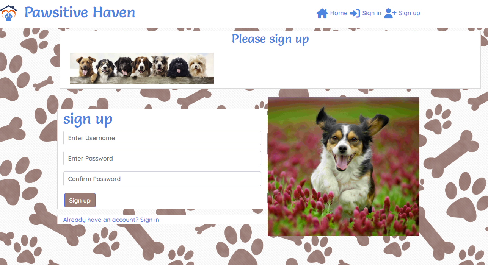

These are standard forms that put the information into a useState variable and then post it to the dj-res-auth/registration or login. They then return you to the previous page. The code also changes the context current user and if you are already logged in when you go to the login page it will automatically redirect you using a hook. The form also has a link to sign up on the sign in incase you don't have an account yet.

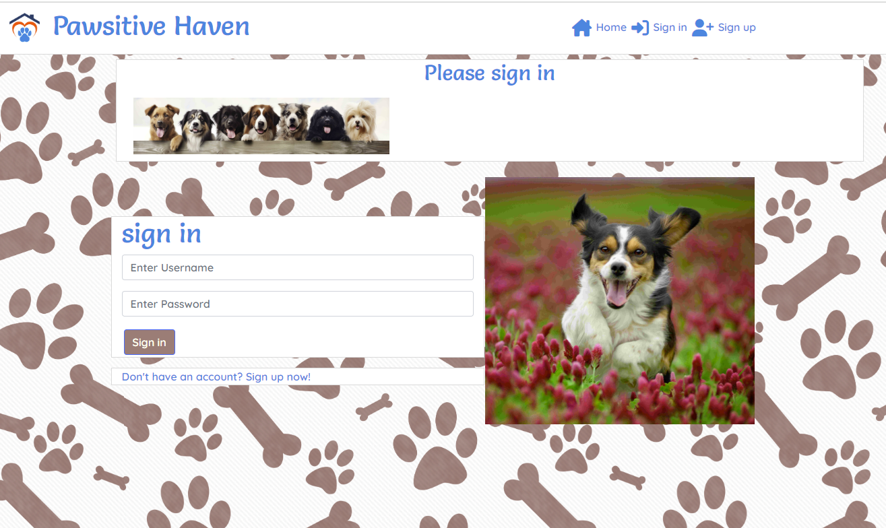

The image was changed but that is about it. As this is not developed code for this project it will not be discussed further here.

##### comments

For this section the functionality for the CommentCreateForm and CommentEditForm and Comment files were taken fairly directly from the [CI Moments Walk through](https://github.com/Code-Institute-Solutions/moments/tree/304244f540308ff4dd3c961352f55a633a4b3bed/src).

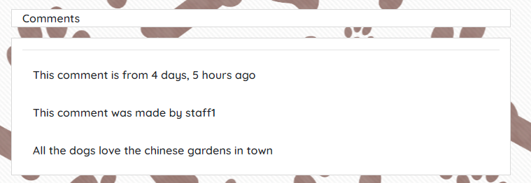

The forms uses state to manage the comments which are linked to a post by post id and the person that made the comment by user id. The comment is stored in comment_content, which uses form validation to ensure the comment has text and then posts/puts the data to the api on submit. It has form handling for change and submission with the input fields in the return statement.

The submit button is disabled if the form is blank.

The comment component displays the comment and also uses the user_id to defensively program so that only the owner can edit and delete the comment with conditional rendering using is_owner to display the moredropdown threedots with the options of edit and delete. 

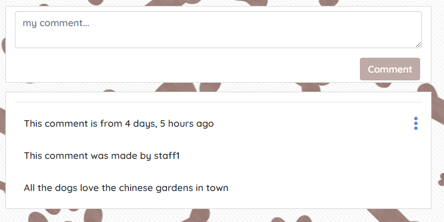

If edit is chosen it sends you to the edit page but handle delete is a function in the comment component.

As this is not developed code for this project it will not be discussed further here.

#### dogProfile

This area of the site required four files. The component Dog and a create, edit and view page.

The profile itself had quite a few variables as listed here from the API:

        "id": ,
        "dog_name": "",
        "created_at": "",
        "updated_at": "",
        "received_date": null,
        "rehomed_date": null,
        "returned_date": null,
        "dog_age": ,
        "dog_breed": "",
        "dog_gender": 0,
        "dog_size": 0,
        "dog_image": "https://res.cloudinary.com/dykxglqm8/image/upload/v1/media/../dog-image-na_zmmfot",
        "at_rescue": false,
        "status": 0,
        "general": "",
        "home_cats": false,
        "home_dogs": false,
        "home_animals": false,
        "home_children": false,

Although based on the user profile from the Moments walkthrough this profile is significantly more complex. There are a couple of data types that are not present in the moments walkthrough, the ones that have no result or "" are similar to the walkthrough as they are text, integer or time and date fields that can be handled as per the walkthough. Id is automatically generated by the system.

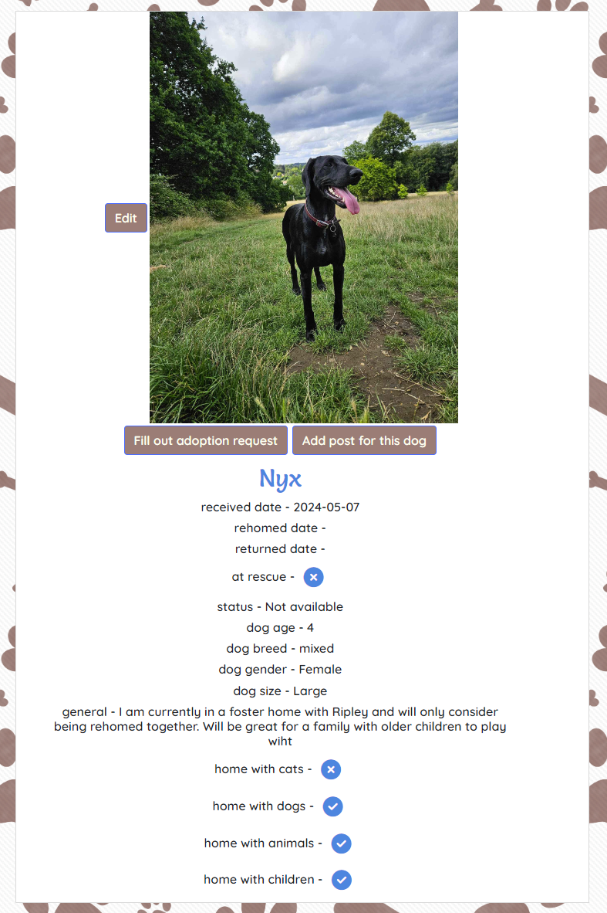

The image above shows all the possible buttons and information that are available. If you are logged in as staff you will see the add post button, the dates and status and whether the dog is at the rescue. As a superuser you also get the Edit button. These are conditionally rendered so aren't present below the necessary level of authorisation.

Despite some initial difficulty with the dog_image on several issues with displaying, can't have one when saving, must have one when saving, but this was all down to cloudinary version issues so should now work. 

The system did not tolerate a blank image so it was decided to insert a default image. It also helped the layout of the front end to look consistent if there is always an image. So if a photo of the dog is not yet available there is an image of a blue (matching the theme) silhouette dog with the phrase Image not yet available. This keeps all the layout consistent.

The more complex features of this set of data are the Boolean values, the select lists and the dates that are initially set to null.

Boolean values are true or false and need to be rendered in both the view and form. To look into how to perform this (as react js doesn't use if, elif and else) the switch statement was investigated. This was found on [url W3](https://www.w3schools.com/js/js_switch.asp).

To render true or false in an easily interpretable way font awesome circles with options of ticks, crosses or question mark (default if no data) were used.

```JS
const getBoolean = (value) => {
    switch (value) {
      case true: 
        return <i class="fa-solid fa-circle-check"></i>;
      case false:
        return <i class="fa-solid fa-circle-xmark"></i>;
      default:
        return <i class="fa-solid fa-circle-question"></i>;
    }
  }
```

Select lists were used where specific text was required. An integer was stored in the database but a phrase was rendered. This was also done using switch / case

```js
 const getDogGender = (dog_gender) => {
    switch (dog_gender) {
      case 0:
        return 'TBC'; // To Be Confirmed
      case 1:
        return 'Male';
      case 2:
        return 'Female';
      default:
        return 'Unknown'; // Default case for unexpected input
    }
  };
```

As there were dates that at the time of the profile being created would be unknown, we need that field to be blank but fillable at a later date, so Null was used. Although not ideal for rendering in view as it leaves the field blank, it does the job.

The problem with a null date is that although the create form validation accepts an empty field. The Edit form when it has a value Null gives an error that it is not the correct format so the form validation does not accept it.

Therefore if the date was null it needed to be changed to an empty string which would be accepted.

```js
const received = (receiveddate) => {
    if (receiveddate === null) {
      setDogData({
        ...dogData,
        received_date: ""
      })
    }
  }
```

This caused a problem in that only one of the three dates was being updated each time as three things were attempting to access the same setDogData simultaneously. Also the system needed to wait till the data had been collected from the API. 

In a lot of cases you can use '?.' function, but as this didn't seem to work in this case, a setTimeOut function was used. These were each given a different time and not on-Mount (as 'get' hadn't been performed) so that it wouldn't all be using setDogData at the same time.

```js
const Time = () => {
    useEffect (() => {
      const timereceived = setTimeout(() => {
        received(received_date);
      }, 800);
      const timerehomed = setTimeout(() => {
        rehomed(rehomed_date);
      }, 1000);
      const timereturned = setTimeout(() => {
        returned(returned_date);
      }, 1200);
    }, []
    )
    return null;
  }
```

The timeout can't be put in handleMount as the data that it wants to work on is async and so won't be there when the function runs. Therefore it was put to return none once it had updated it's variables and the function runs in the return but renders nothing.

The Dog component is the simplest view of the dog, it gives minimal information so that it can be included in a list of dogs and easily scrolled through. The text or the image of the dog can be clicked as a link to take the user to a more detailed single record of the dog.

The only complicated value on Dog component is gender which required getDogGender as discussed above.

DogProfile is the individual record page. It requires information not just on the dog but also on the person viewing the page. Initially a promise.all was used to get dog profile data and user profile data. However, this caused errors when there was no one logged in as none of the data was presented. Therefore it was split into two separate try gets through axios.

The reason that the page required information on the user is that there is conditional rendering of the edit restricted to superusers and conditional rendering of the date and at rescue data and ability to add post button restricted to staff. This should prevent people who don't have access to this in the API having buttons to be able to do it.

The second reason that the user information was required was so that the request adopt functionality could check there is a logged in user before rendering the button to click for the adoption request form and at the same time the dog id needs to be passed via the url. This helps restrict the create post and request adopt areas of the site which require a user to be logged in or causes an error on the forms.

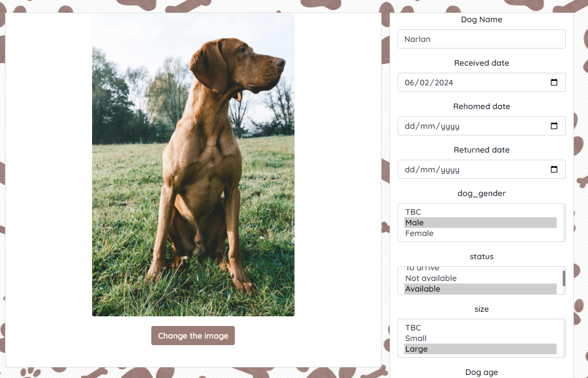

The forms for create and edit also required extra coding for the select feature to provide the options and let the form control be as select.

```js
<Form.Control as="select" custom name="status" htmlSize={2} value={status} onChange={handleChange}>
            <option label="To arrive" value="0">0</option>
            <option label="Not available" value="1">1</option>
            <option label="Available" value="2">2</option>
            <option label="Rehomed" value="3">3</option>
          </Form.Control>
```

The Boolean also required different information:

```js
<Form.Check 
              type="checkbox"
              id="home_dogs"
              label="home with dogs"
              name="home_dogs"
              checked={home_dogs}
              value={home_dogs}
              onChange={handleBooleanChange}
          />
```

it required the type to be checkbox and the checked value to be introduced so that it matched the value that was being stored and retrieved using the API.

#### home

This is the page that the user will land on when they come to the site. There were initially two options for content on this page. During the design wireframes stage, it was decided that to align with the primary aim of getting the dogs adopted that it would be a brief version of the profile. The other option would have been the stories feed, but that is less aligned with what we want members of the public to think about.

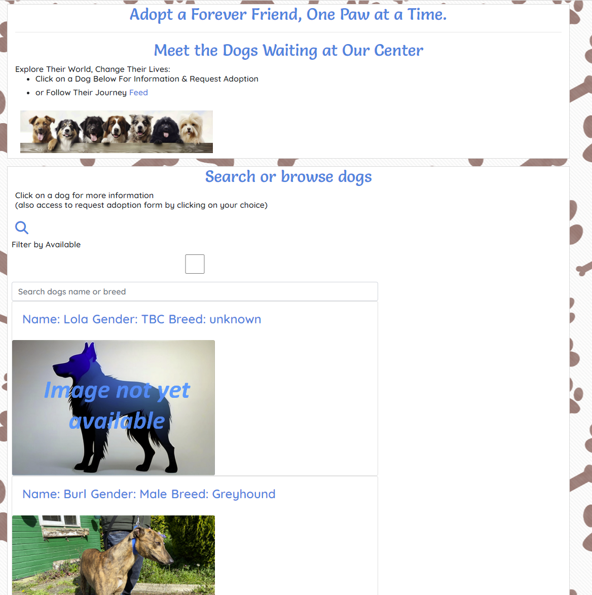

There is a call to action on both the home page and feed at the top of the page explaining briefly what the user can do. This conditionally renders depending on whether it is on the feed or home page and whether there is a user logged in as to which instructions it gives.

The main area allows you to search the dogs that are available with a check box, or if you are looking for a particular breed or know the name you can type that in the search box. 

The page has infinite scroll so it doesn't get held up if there are lots of records to download. It also has the spinner for while it is loading so that the user can see that something is happening while they wait.

The code is set up so that other filters can be included if the checkboxes are coded and the values put in the url

```js
const { data } = await axiosReq.get(`/dog_profile/?dog_gender=&dog_size=&home_cats=&home_dogs=&home_animals=&home_children=&status=${getAvailable(available.available)}&search=${query}`);
```

this would allow for gender, size, status and what the home can already contain to filtered by. The end where it sayes search=query is where the text search is avaiable.

#### posts

This was adapted from the walkthrough code. The most important difference from the walkthrough is that the posts are by a user (in this case staff) but not about themselves but about a dog. This meant that there were two profiles to connect to for each post. The dog profile and the person creating the post profile. So whereas the walkthrough could just take the user that is logged in as who was being posted about.

The post component is just a display of the dog name and image and the post (title, content and image) therefore as it would always be part of another page it could take props from where that page had already gather the information. The props didn't include the dog name and image (as this hadn't been functionality in the original walkthrough) so these had to use a get function to collect them.

A card display was used for this which had conditional rendering of edit and delete functionality depending on whether the logged in person was the person that had generated the post originally.

The post component either was used in the PostsPage which is the feed of the site and contains all the posts or as a component for an individual PostPage which had the additional component of the comments. 

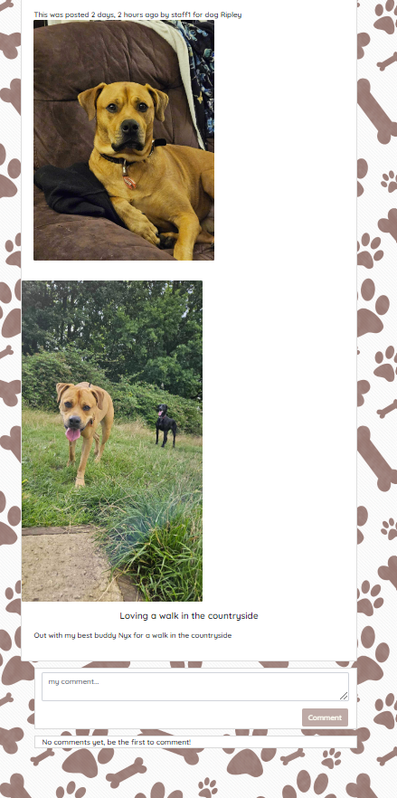

So on individual posts you could comment and see the comments already in place, but in the feed it was just the post. 

From the feed page to get to the individual post you could click on the post image and it would take you there. 

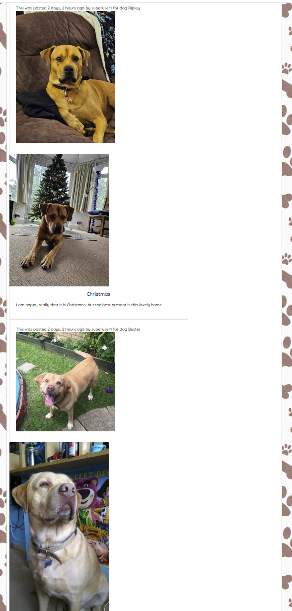

If you click on the image of the dog it will take you to the profile of that particular dog.

The likes and comment counts were not included from the walk through. The comment count was considered a low priority and although some of the code (especially in the backend)had been prepared it was not completed as time for this level of priority ran out in the front end coding. The likes wasn't planned to be part of the project. The emoji app that was in the very initial ideas would have been similar functionality but with approx 5 icons rather than just a like. It was realised in the planning stages that this was not feasible in the timescale that was allowed so even the backend code was not started for this.

Posts (and their comments on the PostPage) can only be created by staff but can be viewed by anyone including people who aren't logged in. 

#### request adopt

The request adopt form needs to know who is signed in so that it can attach that user to the request and also which dog they clicked on to fill out the request. The dog that they clicked on is a plain text field that can't be altered. There is the same functionality as for other boolean fields used here to record the form entries.

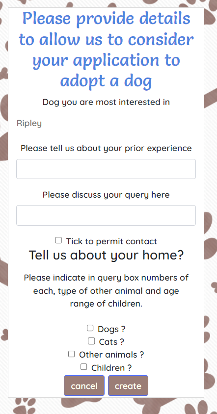

The view request has conditional rendering depending on if it is a superuser that is viewing it - when the contact details of potential adopter are also shown, including name and email.

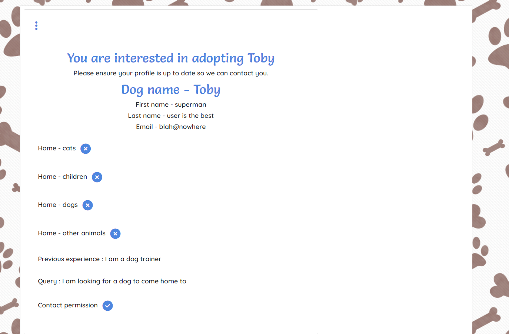


#### user profile

The user profile was a slimmed down version of the Moments walkthrough as this was specified to not count towards the novel models etc for assessment. There was no relevance in an image so this part of the code was removed. An equivalent image was done in the dog profile who the site was emphasising. Apart from authentication the users information that would be relevant would be their username if they posted/commented. Or if they decided that they wanted to adopt a dog the rescue would want to contact them so an email and name would be useful.

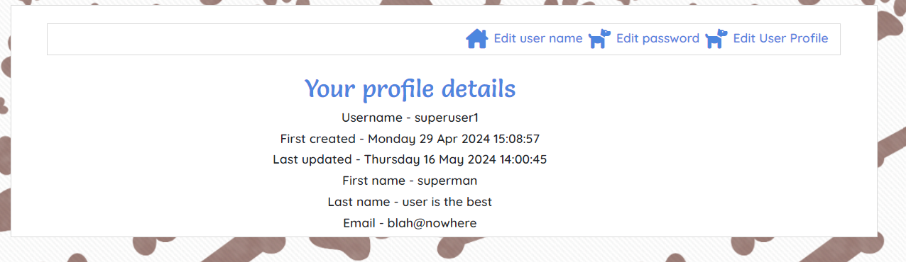

The name and email are not part of the initial signing up for the site so there is a form which you can enter or edit these. Taken from the walkthrough code there are forms to change their password or username also.

All of those forms can be accessed through the edit user nav bar which is visible on the profile page. 

The profile is restricted to the person logged in as when you click on any of the links to get you to the viewing or editing pages it uses the logged in person to determine which profile to look at.

The only time that information is taken from this data that it isn't the user is when a superuser is looking at the adoption requests when the contact details are available as part of the rendering of the request.

#### Defensive programming

This was done by conditional rendering would be better to use redirect. The API restricts the data that is available, but this means that should someone type directly into the url rather than use only the buttons that are available to them that they would still get the page it just wouldn't contain the data.

#### Favourite

Was started to be coded but broke a lot of other functionality, it was initially commented out but there was not enough time to come back to the code as it wasn't possible to prioritise it within the deadline.

It would have meant that a user could pick certain dogs as their favourites and then when the filters were applied on the home page one of them could have been just for the favourites. 

This information may have been useful to the rescue as well as it would be able to see dogs that had a lot of interest or people that were showing an interest in a lot of dogs.

#### Navigation

There are five types of navigation within the site

- hamburger
- three dots
- login/logout/sign up at the top
- profile/username/password edit 
- side site functions

The hamburger and the three dots are used to provide menus without them taking up a lot of space on the screen. 

The hamburger is used for the navigation menus when the screen size is too small or all the time for the side menu so as it doesn't swamp the view.

The three dots is consitently throughout the site to allow you to edit the item or delete it.

Login/logout/signup menu is always available at the top of the screen.

The Profile menu is only available on each of the pages in the profile section.

The side site functions menu contains all the functions that are available to the user. This is conditionally rendered depending on whether you are signed in and what level of authorisation you have. As super user has all the functions and when not logged in you only have links to public pages.

#### handleEdit and handleDelete and handleChange and handleChangeImage

Most sections of the site have a variety of handle functions on one or more of the pages. 

HandleChange is used to update the data as things are entered into the forms so that the data in the form is the data that will be posted or put in the database. This updates the state where the data is temporarily held till it goes to the API. There is a handlebooleanchange that is just slightly different as it requires an input of a checked or unchecked box but a value of true or false. The handlebooleanchange therefore takes the name of the variable from the form and whether it is checked and inputs that to the state.

```js
const handleChange = (event) => {
    setDogData({
      ...dogData,
      [event.target.name]: event.target.value,
    });
  };

const handleBooleanChange = (event) => {
    const { name, checked } = event.target;
    setDogData({
      ...dogData,
      [name]: checked,
    });
  };
```

Images are slightly different so required a handlechangeimage as images are saved to cloudinary then you have a url to access that image not an image file.

```js
const handleChangeImage = (event) => {
    if (event.target.files.length) {
      URL.revokeObjectURL(dog_image);
      setDogData({
        ...dogData,
        dog_image: URL.createObjectURL(event.target.files[0]),
      });
    }
  };
```

handledelete just uses the delete function and the url of the part of the backend that needs deleting. The url is the app to delete from and includes the id or pk of the individual record to delete. Ideally there would be more defensive programming to protect the delete.

```js
const handleDelete = async () => {
    try {
        await axiosRes.delete(`/request_adopt/${id}/`);
        history.goBack();
    } catch (err) {
        console.log(err);
    }
  }
```

handleedit redirects you to the page that contains the edit form for whatever activity/record you are dealing with and also passes the id of the individual record.

```js
const handleEdit = () => {
    history.push(`/request-adopt/edit/${id}/`);
  };
```

#### handle submit

handlesubmit collects all the variables and their values into FormData and then post or puts them to the correct part of the API using the id of the individual record.

```js
const handleSubmit = async (event) => {
    event.preventDefault();
    const formData = new FormData();

    formData.append('dog_id', dog_id);
    formData.append('contact_permission', contact_permission);
    formData.append('experience', experience);
    formData.append('query', query);
    formData.append('home_cats', home_cats);
    formData.append('home_dogs', home_dogs);
    formData.append('home_animals', home_animals,);
    formData.append('home_children', home_children);

    try {
        await axiosReq.put(`/request_adopt/${id}/`, formData);
        history.push(`/request-adopt/${id}`);
    } catch (err) {
        console.log(err);
    }
  };
```

#### useState

All variable data is held in states which are relevant for the page or component that is being used.

The states are set when getting data from the API and setting the data in the state is done whenever there is a change using the various handlechanges.

#### Forms errors

To keep the users informed if the wrong format or type of entry has been put into a form, the forms have alerts which take the errors and provide them to the user so that they can adjust their input.

```js
            {errors.home_children?.map((message, idx) => (
                <Alert key={idx} variant="warning">
                  {message}
                </Alert>
              ))} 
```

#### call to action / form title conditinal rendering


### Potential Future Feature Developments 

There was a lot of ideas initially for things that could be done with this site. Emojis to like/dislike/laugh at posts and comments that were quickly put in the won't have category due to the timescale of the project. There were several things that along the way were also discarded as well as idea that were generated during the production of the site. Here are some suggestions of what extra features seem like they would add value in future development.

1. An area for staff to put general comments that are internal so that the staff and admins looking after the dogs can have information that isn't relevant to the general public or should be kept confidential. It could also be used for just comments about general welfare and care of the dogs, like which things they prefer or if they are currently requiring special treatment or need specific harnesss etc.
2. It would be nice if when you look at the profile of a specific dog the posts that are about that dog were underneath, this was an initial intent of the project but due to time constraints other functionality became far more essential.
3. Put together the pages for dog vaccinations. The backend has all the variables set up but doens't have anything in the front end to read or manipulate it. It would be nice to have this data stored and it could easily do calculations from dates that vaccines were given as to when they would need repeating in the future and provide lists of soon to be or overdue vaccinations.
4. The home page currently only has a filter to see narrow it down to dogs that are currently available, the groundwork has been done for other filters to be put on the page, this would mean that the users who are looking to adopt could quickly narrow down their search or find if there are no dogs currently suitable for them. Filter by what animals and children are already in the home and gender/size etc
5. The favourite app was built in the backend but wasn't implemented in the front end. An attempt at coding this did take place breifly, but as it broke other functionality it was decided that this might be a bigger amount of work than had been anticipated and so it was moved down in priority.
6. Potentially a dog context could be set up. This would need to be thought about but as moving from page to page currently the same dog profile information is frequently downloaded. The exact use and data included would need to be carefully considered before it was implemented.
7. There are many function that I have cut and paste into many locations with time to make the code more efficient some of these functions could be put into hooks.
8. RequestAdopt and RequestsAdopt are both components that with a small amount of recoding could just be one that is capable of taking an array or an individual record.
9. Functionality to inform the user that no information was returned from their search in a couple of searches would keep the user informed. Currently some components get left on a spinner when there is nothing for it to show. Some data like for rehomed dates etc are left empty until they occur it would be nice if rather than being blank there was information to the user that this hasn't been filled yet.
10. A no access component was set up that could be used in place of components or pages when people attempt to access things that their level of authorisation does not allow them to access as currently they get the page just with no information or when the press the button nothing happens.
11. The styling was left too late in the process, there are several things that with some time and rearrangement would look better and improve the user experience if resized or moved to better locations or made more or less prominent or distracting.
12. Additonal/improved alt text for the pictures that are introduced by staff etc. to improve accessibility.
13. The feed could allow you to search for a dogs name as currently it will only let you search the posts section. Then you would be able to see all the posts about a particular dog.
14. Some defensive programming stoping immediate delete and checking with user that they intended to delete.
15. It would be nice if when you look at the user profile that you could see your own posts to look at comments that had been made on them or feel nostalgic but due to time constraints other functionality became far more essential.

New ideas for the site are constantly evolving as there are so many pages that could be used for admin of a rescue if they started to record how adoptions were progressing etc. Or adding more functionality to the feeds and profiles to keep up with current trends.

## Bugs

There have been several interesting and challenging bugs that have been overcome during the development of this project. All bugs that have been found for implemented functionality have been fixed along the way.

There are a few things that could be considered bugs that are beyond the time available to fix and are either unlikely to occur or are considered to be features still to implement and put in the future development section. The site functions as expected for the functions that have been implemented.

The bugs that have been fixed along the way except number 7:

1. Images have been a real problem throughout the project. Initially there were areas where I thought that images could be left blank, but having implemented that it was realised that the dimensions of various components were completely disorientated without an image there. A default image was then put on the dog profile which explained that an image wasn't avaiable yet. Then there was problems with having to change the images everytime anything in the component was changed. This forced image change was rectified by changing the code from the profile image saving code from the walkthrough to the post image saving code from the walk through.
There was also a stage where the error that was being returned to me stated that the cloudinary field needed to be read-only which would have been extremely detrimental to the functionality.
Sometimes it refused to accept an image was an image file that had already been saved fine before was an image. Eventually after a multitude of different problems with the images tutor support was contacted who suggested changing the version of cloudinary. Normally I have found that I am using too new a version compared with a walkthrough, but on this occassion the one that matchd the walkthrough would not work consistently so the tutor recommended the higher version that they use frequently. This solved all the image problems except one where if you change and image then go to change it again and go back to the original image but press cancel it saves the wrong image. As people are unlikely to change their minds that often and can go back in and put in the correct image it was decided that this was an inconvenience rather than a bug. With time and investigation it probably could be fixed by getting the correct url saved in a variable. This could be a future improvement if it were to ever be prioritised or become a more serious problem.
2. When comments app was initially included all the comments appeared against all of the posts. After adding a multitude of console.logs to attempt to ascertain the problem it suddenly started putting the correct comments against the correct posts. This suggests that some spacing or a typo was creating the problem and when adding the extra lines of code it was solved.
3. Displaying and handling the change of boolean variables was more interesting than initially anticipated. It was expected that the word true or false would be displayed, however this is not the case so ultimately when it was realised that the display would require a function it was decided that it was just as efficient to display an icon from fontawesome of a tick or cross or question mark(if not data)

```js
const getBoolean = (value) => {
    switch (value) {
      case true: 
        return <i class="fa-solid fa-circle-check"></i>;
      case false:
        return <i class="fa-solid fa-circle-xmark"></i>;
      default:
        return <i class="fa-solid fa-circle-question"></i>;
    }
  }
```

When creating or editing a boolean there was also an interesting challenge as the checkbox doesn't necessarily translate straight to a true or false so rather than the standard function of handlechange dealing with these checkboxes it was necessary to write a separate function that recognised the name to attribute it to the variable and changed checked to true or false.

```js
  const handleBooleanChange = (event) => {
    const { name, checked } = event.target;
    setDogData({
      ...dogData,
      [name]: checked,
    });
  };

```
Even once these challenges had been overcome there was still some very weird data being recorded by the create and edit functions. It seemed to intermittently record true or false and randomly get it right. This was extremely confusing. It was only when it would only work if the value was changed several times before saving that it would get it correct that it was realised that the model was empty during create and the back end was set to true as default for some of these values and false for others, but the checkboxes always started as empty that it was realised that to get true the box needed to be ticked, but to get false it needed to be ticked then unticked. 

Setting all the booleans to default to false in the backend which matched the check boxes original state made a huge improvement. But there was still some occasions when it wasn't matching. This was because the checkbox when editing wasn't receiving a starting value from the API to display. So the checked={variable} needed to be set on the checkboxes so that it was matching the data stored.

The intermittency of this problem not logically matching any perceivable pattern as there were so many factors contributing to it made this an interesting solve.

4. useParams was a new function for me and it took a long time to figure out that a lot of functions that weren't working were due to not deconstructing the const { id } = useParams(); especially as the brackets at the end were also initially missing. A 

5. When attempting to save dates which were empty in the edit form form validation informed me that the date was in the wrong format. However, the exact same code was working when I used the form for create. This turned out to be that the initial value in the field was an empty string which the validation accepted when it was being created this was turned to a Null. The Null value was not accepted by the validation. Therefore, it needed to be returned to an empty string only when the value was null. As the data was collected by a get request when the page mounted this also had to be delayed otherwise the check for the null occurred before the data had arrived. There was potentially 3 empty dates in the same form which were part of dogData state so these also needed to be staggered so that they weren't attempting to update the same state at the same time.

This was solved with two functions 

```js
const returned = (returneddate) => {
    if (returneddate === null) {
      setDogData({
        ...dogData,
        returned_date: ""
      })
    }
  }

  const Time = () => {
    useEffect (() => {
      const timereceived = setTimeout(() => {
        received(received_date);
      }, 800);
      const timerehomed = setTimeout(() => {
        rehomed(rehomed_date);
      }, 1000);
      const timereturned = setTimeout(() => {
        returned(returned_date);
      }, 1200);
    }, []
    )
    return null;
  }
```

6. When deleting a post it deletes the dog as well was a problem as it quickly empties the database as the dog then deletes all posts associated with it. It was decided that there shouldn't be any reason to delete dogs so to remove that possibility. The reason that the deletion of posts was deleting the dog as well is because the dog_id was a foriegn key which had on_delete as CASCADE. Upon investigation it appears that you can set on_delete to PROTECT according to this [weblink](https://medium.com/@inem.patrick/django-database-integrity-foreignkey-on-delete-option-db7d160762e4#id_token=eyJhbGciOiJSUzI1NiIsImtpZCI6IjMyM2IyMTRhZTY5NzVhMGYwMzRlYTc3MzU0ZGMwYzI1ZDAzNjQyZGMiLCJ0eXAiOiJKV1QifQ.eyJpc3MiOiJodHRwczovL2FjY291bnRzLmdvb2dsZS5jb20iLCJhenAiOiIyMTYyOTYwMzU4MzQtazFrNnFlMDYwczJ0cDJhMmphbTRsamRjbXMwMHN0dGcuYXBwcy5nb29nbGV1c2VyY29udGVudC5jb20iLCJhdWQiOiIyMTYyOTYwMzU4MzQtazFrNnFlMDYwczJ0cDJhMmphbTRsamRjbXMwMHN0dGcuYXBwcy5nb29nbGV1c2VyY29udGVudC5jb20iLCJzdWIiOiIxMTYwNzAxOTExNzA0MTQ2MTczMDAiLCJlbWFpbCI6InJhY2h3YWxtNzVAZ21haWwuY29tIiwiZW1haWxfdmVyaWZpZWQiOnRydWUsIm5iZiI6MTcxNjI4MjEzNywibmFtZSI6IlJhY2hlbCBXYWxtc2xleSIsInBpY3R1cmUiOiJodHRwczovL2xoMy5nb29nbGV1c2VyY29udGVudC5jb20vYS9BQ2c4b2NMeTR1QUJVODd6SS01bU4zZkdaTEExMmlhWGRIRGM4SVdmWVdIdWhTcklGamxfM0E9czk2LWMiLCJnaXZlbl9uYW1lIjoiUmFjaGVsIiwiZmFtaWx5X25hbWUiOiJXYWxtc2xleSIsImlhdCI6MTcxNjI4MjQzNywiZXhwIjoxNzE2Mjg2MDM3LCJqdGkiOiJiOWZlMTVlNTM2MGQzMjhiNWRlODIzYmU3NGEwNjZmYTIwMDE2ZjkxIn0.j4F5f7bjwpvZcRyFj3xSmjegoqGB6e2ab3M6SuAVobkZ2Y1-fE6EReWHqAGA3Wn_PinDM8Vitu3Vp2h2RCOdhKT3urWs3GIJyTju7U9X6y_qN-X5yhFmpYGCNbDUNq_RVU38PfGEIZzHUwHp_w4phOcSc5990npljXJXWDa5yPBwmwAIKkonxFwwR5ps_ui6y7fk3xHjyDCmfWccPj5PuNhdYy-dJAi9PwRfsKpFzNVKD-214TGz1MCtZKtnpiVoMTjkS8Rpzm63vmIVK-6AdP5NKFQCRhw934wQENSKUhoB8ygEMvdELXuf5V0TafxYL4bB8SZthkA-P7nmFAc3tA).
This brought up the consideration that deleting dogs may leave some orphan posts or take away lots of stories that people treasured,  so therefore removed the delete dog option from the website, in the place where it would normally have a edit or delete dog profile it now just has the edit button instead of the three dots to give edit or delete.

7. During testing of the dog profile create form it was realised that in the dog profile model the dog age had been set to blank but not to Null. This meant that the error in the react wasn't appearing when it was left blank. Therefore the model was updated, makemigrations --dry-run then makemigrations then migrate were performed. After this when the API was run it gave the error 

```django.db.migrations.exceptions.InconsistentMigrationHistory: Migration posts.0003_alter_post_dog_id is applied before its dependency dog_profile.0003_alter_dogprofile_dog_age on database 'default'.```

This failed to deploy on Heroku. However, the API on Heroku does appear to work. So after attempting to research how to fix this and discussing with tutor support (explaining that there were still other issues as well) I decided not to fix this. The fix would have taken me over my submission deadline from experience of the procedure before. I would need to get an empty database, clear out the migrations from the apps leaving just __init__.py then run the migrations. However, this would mean that everything in the database would be gone and I wouldn't have time to set it back up for assessment. This may affect some of the functionality as left unfixed however it appears to be working.

## Technologies

### Languages used

- [HTML](https://developer.mozilla.org/en-US/docs/Web/HTML) 
- [CSS](https://developer.mozilla.org/en-US/docs/Web/css) 
- [JS](https://developer.mozilla.org/en-US/docs/Web/javascript) 
- [JSX](https://react.dev/learn/writing-markup-with-jsx)

### Frameworks and libraries

The reason that the below libaries were chosen is that the project was based on the Moments walkthrough, as previously mentioned where there was code from the walkthrough that could be used with slight adaptation. Therefore the basis of the project matches the Moments and the assessment required that it was based the main technologies of HTML, CSS, JavaScript, React.js, Bootstrap. js and Django REST framework. Having that criteria it was only a choice as to which additional libaries to use. Most of the libararies are bolt ons to react (even in their names) so were chosen for their known compatibility. Axios and JWT were chosen due to experience with them in the walkthrough. dj-rest-auth is a django rest authorisation libary so was an obvious choice after experiencing it in the walkthrough. The specifics of what functionality I wanted when choosing each one is written next to it's link. 

- [Boostrap](https://getbootstrap.com/docs/5.0/getting-started/introduction/) for styling the site.
- [React-bootstrap](https://react-bootstrap.github.io/) for coding site and styling.
- [React](https://react.dev/) for coding site.
- [Axios](https://axios-http.com/docs/intro)for interaction with the API, get, put, post etc
- [JWT tokens](https://jwt-auth.readthedocs.io/en/develop/) for access and refresh tokens to maintain the security of the site and keep it as a REST site as nothing is stored on the server as to who is logged in.
- [React dom](https://react.dev/reference/react-dom) rendering components as a website etcetc
- [React router dom](https://www.npmjs.com/package/react-router-dom) for connecting up all the urls for different parts of the site turning react router into availability to the web
- [React infinite scroll](https://www.npmjs.com/package/react-infinite-scroll-component) so that it quickly loads a certain amount at a time, then loads the rest when you move down far enough to need it.
- [React scripts](https://www.npmjs.com/package/react-scripts) gives the scripts to create a react app
- [dj-rest-auth](https://dj-rest-auth.readthedocs.io/en/latest/) was the backend login/logout/register but was interacted with front end

Ideally time would have allowed for testing with Jest but this did not occur so that libary was not used.


### Databases

- [SQLite](https://www.sqlite.org/index.html) development database.
- [PostgreSQL](https://www.postgresql.org/) deployed database.


### Tools

- [VSCode](https://code.visualstudio.com/) was used to create and edit the website.
- [GitPod](https://www.gitpod.io/docs/introduction) as an IDE
- [Git](https://git-scm.com/) was used for the version control and project board to plan the project.
- [Heroku](https://www.heroku.com/) was used to deploy and host site.
- [Pip3](https://pypi.org/project/pip/) was used for installing.
- [Elephantsql](https://www.elephantsql.com/) to host the postgreSQL database for deployment.
- [DrawSQL](https://drawsql.app/) for relationship diagram drawing.


### Web resources

- [Chrome-DevTools](https://developer.chrome.com/docs/devtools/) were extremely useful for trying out different code without affecting my core code and particularly when working on responsiveness.
- [Lighthouse](https://developer.chrome.com/docs/lighthouse/overview/) was used to check for performance and accessibility.
- [HTML-markdown-validator](https://validator.w3.org/) was used to validate the HTML.
- [CSS-validator](https://jigsaw.w3.org/css-validator/) was used to perform the CSS validation.
- [Jshint](https://jshint.com/) was used to validate the JS.
- [favicon](https://favicon.io/favicon-converter/) to generate my favicon from my logo.
- [Responsive viewer extension](https://chrome.google.com/webstore/detail/responsive-viewer/inmopeiepgfljkpkidclfgbgbmfcennb) to produce the responsive view for my testing.
- [image compressor](https://compressnow.com/) to reduce the size of the images.
- [Canava](https://www.canva.com/en_gb/) used to generate logo
- [fontawesome](https://fontawesome.com/search?m=free&o=r) was used for the navigation icons
- [google-fonts](https://fonts.google.com/) for the fonts
- [colorzilla](https://chromewebstore.google.com/detail/colorzilla/bhlhnicpbhignbdhedgjhgdocnmhomnp?pli=1) was used to determine colours from background and logo so could be matched to the rest of the site
- [coolors](https://coolors.co/) to display colours in the README


## Deployment

In any deployment it is important to remember that this is only a front end site. The information that is displayed requires the API (or equivalent) to be operational with migrations to a suitable database applied. For this project the API is deployed in [Heroku](https://dog-rescue-dd90e2b7e4a8.herokuapp.com/)

### Heroku deployment

The deployed version can be accessed on Heroku [here](https://*.herokuapp.com/)

Before deployment you will need to collect all the requirements into requirements.txt

Ensure that the version that you want to deploy has been added, committed and pushed to GitHub (as Heroku will take it from the repository).

1. [Heroku](https://www.heroku.com/) was used to deploy.
2. If you can't see the "new" button click on the Heroku logo in the top left


3. From here we are able to create a new app 


4. Next the app was named pawsitive-haven in lowercase and the Europe region chosen in these fields


and the purple 'create app' button was pressed.

5. Now we used the menu navigation bar to select deploy


6. The deployment method was selected by clicking on the GitHub icon and it stated that it was connected to github


The repository was chosen by searching my github and then clicking connect

7. Then the branch was deployed 


12. It was deployed

### Local Deployment

You will need to pip install the following apps:

react-bootstrap

```npm install react-bootstrap@1.6.3 bootstrap@4.6.0```

react router

```npm install react-router-dom@5.3.0```

axios

```npm install axios```

### Cloning

1. In the git hub repository, code button clicked
2. clicked local
3. choose HTTPS
4. link copied
5. went to terminal of the IDE and input the following :git clone https://github.com/RachWalm/pawsitivityhaven

A .gitignore file should be used so that the information in there that should be kept private and not put on GitHub.

To run the local deployment in the IDE terminal window :

```
npm start
```

## Testing 

See [Testing](TESTING.md)

## Credits

### Images

Logo

<a href="https://www.vecteezy.com/free-vector/animal-rescue-logo">Animal Rescue Logo Vectors by Vecteezy</a>

Signup/SignIn image

<a href="https://www.vecteezy.com/free-photos/dogs">Dogs Stock photos by Vecteezy</a>

The image for the awaiting image of dog for the dog profile was created using leonardoAI for default blue dog image and then the program paint was used to add the text to say that the image was not yet available.

page not found 
<a href="https://www.freepik.com/free-vector/construction-web-template-flat-style_1959745.htm#fromView=search&page=1&position=6&uuid=f84ea845-2ed9-4927-8aa5-0931603729bd">Image by freepik</a>

no access page
<a href="https://www.freepik.com/free-vector/prohibited-signs-set-smoking-vape-dogs-food-drink_49610161.htm#fromView=image_search_similar&page=1&position=1&uuid=f4fa4661-2a90-49d8-a4ea-c39411cf5be6">Image by juicy_fish on Freepik</a>

Background pawprints with bones were originally from Canava then changed from black and white to the brown colour usig Canava editing.


Photos of dogs

Photo by Pixabay: https://www.pexels.com/photo/white-short-coated-dog-160846/

Photo by Summer Stock: https://www.pexels.com/photo/adult-german-shepherd-lying-on-ground-333083/

Photo by Pixabay: https://www.pexels.com/photo/pembroke-welsh-corgi-lying-on-the-sand-under-white-cloud-blue-sky-164186/

Photo by Pixabay: https://www.pexels.com/photo/adult-tan-great-dane-532310/

Photo by Dominika Roseclay: https://www.pexels.com/photo/brown-dachshund-sitting-on-the-edge-of-the-bed-1139794/

Photo by Mindaugas: https://www.pexels.com/photo/closeup-photography-of-tan-and-white-boxer-1294062/

Photo by Antonio Florentini: https://www.pexels.com/photo/adult-siberian-husky-selected-focus-803766/

Photo by Steshka Willems: https://www.pexels.com/photo/tired-pug-resting-on-floor-1289557/

Photo by Milica Popovic: https://www.pexels.com/photo/portrait-photo-of-persian-greyhound-1573919/

Photo by Matthias Zomer: https://www.pexels.com/photo/black-and-brown-short-coat-dog-lying-on-the-ground-68798/

Photo by Brian van den Heuvel: https://www.pexels.com/photo/white-dog-1313254/

Photo by E Pro: https://www.pexels.com/photo/brown-and-white-azawakh-puppy-sitting-on-white-surface-1638724/

Photo by chepté cormani: https://www.pexels.com/photo/adult-brown-great-dane-1570146/

Photo by Jackson  Jorvan: https://www.pexels.com/photo/shallow-focus-photography-of-brindle-boxer-puppy-605496/

Photo by Pixabay: https://www.pexels.com/photo/short-coated-brown-dog-on-wooden-beam-260440/

Photo by Sebastian Coman Travel: https://www.pexels.com/photo/black-and-white-long-coated-small-sized-dog-3610168/

Photo by Martin Dufosset: https://www.pexels.com/photo/white-and-black-short-coated-bulldog-3930940/


## Acknowledgements

My Mentor - Juliia Konn has been extremely enthusiastic and provided encouragement and a great deal of support.

My family - Pat Walmsley for proof reading and very useful feedback.

My Partner - Ian Harris has been extremely supportive while I have been working on this project.

Code institute - For all the information and course content that has contributed to the creation of this project. Especially the Moments walkthrough which was heavily relied upon for inspiration and code understanding. [GitHub for moments](https://github.com/Code-Institute-Solutions/moments/tree/304244f540308ff4dd3c961352f55a633a4b3bed/src)

Code institute tutors - Who worked very hard and often were very motivational and increased my faith in myself.

W3 website for many clarifications of syntax.

